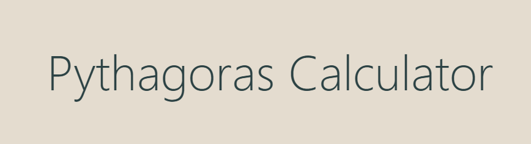

- Página Web em HMTL, CSS e Javascript que permite realizar o cálculo da relação do Teorema de Pitágoras.
- Nessa página é possível calcular, obtendo um resultado com duas casas decimais, a hipotenusa, o cateto adjacente e oposto de um triângulo retângulo.
- A página está finalizada e em funcionamento.
- Para utilizar basta utilizar o link do GitHub Pages

 Página Web em HMTL, CSS e Javascript que permite realizar o cálculo da relação do Teorema de Pitágoras.
 
 # Autores
- <a href="https://github.com/mailacss">Maila Cardoso</a>
